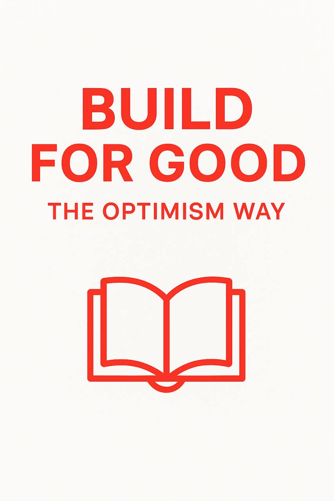

# build-for-good-global-book-texts
Multilingual open-source version of the book “Build For Good: The Optimism Way” — available in 10 languages as plain text.
# 📘 BUILD FOR GOOD: The Optimism Way (Multilingual Texts)

> A multilingual public good book — created to support and inspire builders in the Optimism ecosystem.

---

## 🌍 Available Languages

- 🇺🇦 [BUILD FOR GOOD Шлях Оптимізму_ukrainian.txt](BUILD%20FOR%20GOOD%20Шлях%20Оптимізму_ukrainian.txt)
- 🇬🇧 [BUILD FOR GOOD The Optimism Way_english.txt](BUILD%20FOR%20GOOD%20The%20Optimism%20Way_english.txt)
- 🇩🇪 [BUILD FOR GOOD Der Optimism Weg_german.txt](BUILD%20FOR%20GOOD%20Der%20Optimism%20Weg_german.txt)
- 🇫🇷 [BUILD FOR GOOD La Voie dOptimism_french.txt](BUILD%20FOR%20GOOD%20%20La%20Voie%20d’Optimism_french.txt)
- 🇪🇸 [BUILD FOR GOOD El Camino de Optimism_spanish.txt](BUILD%20FOR%20GOOD%20El%20Camino%20de%20Optimism_spanish.txt)
- 🇵🇹 [BUILD FOR GOOD O Caminho do Optimism_portuguese.txt](BUILD%20FOR%20GOOD%20O%20Caminho%20do%20Optimism_portuguese.txt)
- 🇮🇹 [BUILD FOR GOOD La Via di Optimism_italian.txt](BUILD%20FOR%20GOOD%20La%20Via%20di%20Optimism_italian.txt)
- 🇮🇳 [BUILD FOR GOOD उम्मीद का रास्ता_hindi.txt](BUILD%20FOR%20GOOD%20उम्मीद%20का%20रास्ता_hindi.txt)
- 🇨🇳 [BUILD FOR GOOD Optimism 的道路_chinese.txt](BUILD%20FOR%20GOOD：Optimism%20的道路_chinese.txt)
- 🇸🇦 [BUILD FOR GOOD طريق التفاؤل_arabic.txt](BUILD%20FOR%20GOOD%20طريق%20التفاؤل_arabic.txt)

---

📖 This repository contains the full text of "BUILD FOR GOOD: The Optimism Way"  
in 10 languages, freely available for anyone to read, translate, or remix.

🛠️ Built as a public good for [RetroPGF by Optimism](https://community.optimism.io/retropgf).

👤 Author: Stephan  
🐦 Twitter: [@stephan1516417](https://twitter.com/stephan1516417)

---

X (formerly Twitter) (https://twitter.com/stephan1516417)
stephan-optimism (@stephan1516417) on X
Optimism 
