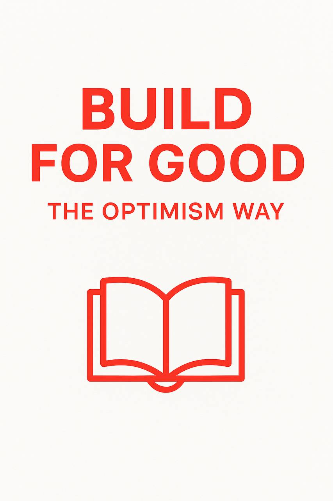
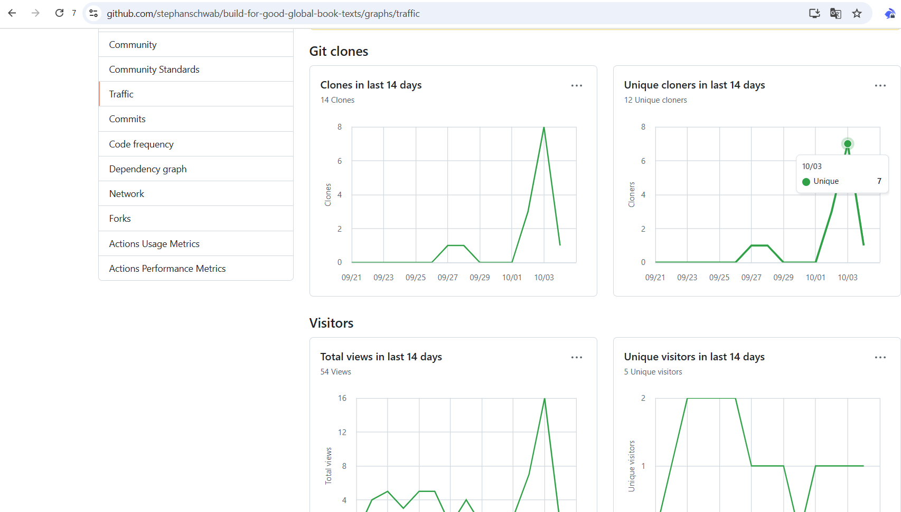

# build-for-good-global-book-texts
Multilingual open-source version of the book “Build For Good: The Optimism Way” — available in 10 languages as plain text.
# 📘 BUILD FOR GOOD: The Optimism Way (Multilingual Texts)
📌 **This project is part of the BuildForGood ecosystem — a multi-project public goods initiative for Optimism.**  

> A multilingual public good book — created to support and inspire builders in the Optimism ecosystem.

---

## 🌍 Available Languages

- 🇺🇦 [BUILD FOR GOOD Шлях Оптимізму_ukrainian.txt](BUILD%20FOR%20GOOD%20Шлях%20Оптимізму_ukrainian.txt)
- 🇬🇧 [BUILD FOR GOOD The Optimism Way_english.txt](BUILD%20FOR%20GOOD%20The%20Optimism%20Way_english.txt)
- 🇩🇪 [BUILD FOR GOOD Der Optimism Weg_german.txt](BUILD%20FOR%20GOOD%20Der%20Optimism%20Weg_german.txt)
- 🇫🇷 [BUILD FOR GOOD La Voie dOptimism_french.txt](BUILD%20FOR%20GOOD%20%20La%20Voie%20d’Optimism_french.txt)
- 🇪🇸 [BUILD FOR GOOD El Camino de Optimism_spanish.txt](BUILD%20FOR%20GOOD%20El%20Camino%20de%20Optimism_spanish.txt)
- 🇵🇹 [BUILD FOR GOOD O Caminho do Optimism_portuguese.txt](BUILD%20FOR%20GOOD%20O%20Caminho%20do%20Optimism_portuguese.txt)
- 🇮🇹 [BUILD FOR GOOD La Via di Optimism_italian.txt](BUILD%20FOR%20GOOD%20La%20Via%20di%20Optimism_italian.txt)
- 🇮🇳 [BUILD FOR GOOD उम्मीद का रास्ता_hindi.txt](BUILD%20FOR%20GOOD%20उम्मीद%20का%20रास्ता_hindi.txt)
- 🇨🇳 [BUILD FOR GOOD Optimism 的道路_chinese.txt](BUILD%20FOR%20GOOD：Optimism%20的道路_chinese.txt)
- 🇸🇦 [BUILD FOR GOOD طريق التفاؤل_arabic.txt](BUILD%20FOR%20GOOD%20طريقة%20التفاؤل_arabic.txt)

Update README (04.11.2025): +5 new languages added (PL, TR, JP, KR, ID)
- 🇵🇱 [BUILD FOR GOOD Droga Optymizmu_polish.txt](BUILD%20FOR%20GOOD%20Droga%20Optymizmu_polish.txt)
- 🇹🇷 [BUILD FOR GOOD İyimserlik Yolu_turkish.txt](BUILD%20FOR%20GOOD%20İyimserlik%20Yolu_turkish.txt)
- 🇯🇵 [BUILD FOR GOOD 楽観主義の道_japanese.txt](BUILD%20FOR%20GOOD%20楽観主義の道_japanese.txt)
- 🇰🇷 [BUILD FOR GOOD 낙관주의의 길_korean.txt](BUILD%20FOR%20GOOD%20낙관주의의%20길_korean.txt)
- 🇮🇩 [BUILD FOR GOOD Jalan Optimisme_indonesian.txt](BUILD%20FOR%20GOOD%20Jalan%20Optimisme_indonesian.txt)

Update README (22.12.2025): +2 new languages added (VI, FA)
- VI [BUILD FOR GOOD Con đường của Optimism_vietnamese.txt](BUILD%20FOR%20GOOD%20Con%20duong%20cua%20Optimism_vietnamese.txt)
- FA [BUILD FOR GOOD مسیر Optimism_persian.txt](BUILD%20FOR%20GOOD%20Masir%20Optimism_persian.txt)
---

📖 This repository contains the full text of "BUILD FOR GOOD: The Optimism Way"  
in 10 languages, freely available for anyone to read, translate, or remix.

🛠️ Built as a public good for [RetroPGF by Optimism](https://community.optimism.io/retropgf).

👤 Author: Stephan  
🐦 Twitter: [@stephan1516417](https://twitter.com/stephan1516417)

X (formerly Twitter) (https://twitter.com/stephan1516417)
stephan-optimism (@stephan1516417) on X
Optimism 

## 📊 Impact Metrics (as of 04/10/2025)

| Metric | Last 14 days |
|---------|---------------|
| 🧩 GitHub Clones | 14 |
| 👥 Unique Cloners | 12 |
| 👀 Total Views | 54 |
| 🌍 Unique Visitors | 5 |

> *Source: GitHub Insights — growth in clones and views (last 14 days).*
> 📘 *Consistent growth shows active interest from the Optimism community and badgeholders exploring the BuildForGood materials.*

## 🌍 BuildForGood Ecosystem  
**This project is part of the BuildForGood Ecosystem for Optimism.**  

📖 Books & Articles • 🕹 Games • 🖼 NFTs & Memes • 🌍 Onchain Artifacts • 🎥 Media  

🔗 Explore the full ecosystem: [BuildForGood Ecosystem on Optimism Atlas](https://atlas.optimism.io/0xd349d01ca7247e321116767150902eb478c8d9d7b86b51cb9abc81c579fe39d5)
---
